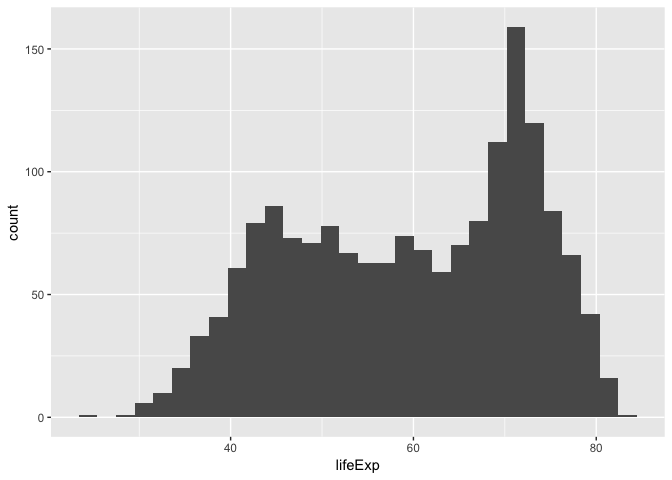
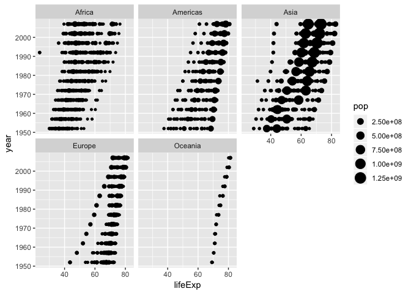

Hw02
================

``` r
require(gapminder)
```

View head of the dataset

``` r
head(gapminder)
```

    ## # A tibble: 6 x 6
    ##   country     continent  year lifeExp      pop gdpPercap
    ##   <fct>       <fct>     <int>   <dbl>    <int>     <dbl>
    ## 1 Afghanistan Asia       1952    28.8  8425333      779.
    ## 2 Afghanistan Asia       1957    30.3  9240934      821.
    ## 3 Afghanistan Asia       1962    32.0 10267083      853.
    ## 4 Afghanistan Asia       1967    34.0 11537966      836.
    ## 5 Afghanistan Asia       1972    36.1 13079460      740.
    ## 6 Afghanistan Asia       1977    38.4 14880372      786.

It's a list

``` r
typeof(gapminder)
```

    ## [1] "list"

It's a dataframe

``` r
class(gapminder)
```

    ## [1] "tbl_df"     "tbl"        "data.frame"

How many columns?

``` r
ncol(gapminder)
```

    ## [1] 6

How many rows?

``` r
nrow(gapminder)
```

    ## [1] 1704

`nrow` and `ncol` are more informative when writing for loops

``` r
dim(gapminder)
```

    ## [1] 1704    6

What are the types of the variables?

``` r
str(gapminder)
```

    ## Classes 'tbl_df', 'tbl' and 'data.frame':    1704 obs. of  6 variables:
    ##  $ country  : Factor w/ 142 levels "Afghanistan",..: 1 1 1 1 1 1 1 1 1 1 ...
    ##  $ continent: Factor w/ 5 levels "Africa","Americas",..: 3 3 3 3 3 3 3 3 3 3 ...
    ##  $ year     : int  1952 1957 1962 1967 1972 1977 1982 1987 1992 1997 ...
    ##  $ lifeExp  : num  28.8 30.3 32 34 36.1 ...
    ##  $ pop      : int  8425333 9240934 10267083 11537966 13079460 14880372 12881816 13867957 16317921 22227415 ...
    ##  $ gdpPercap: num  779 821 853 836 740 ...

Possible values

``` r
unique(gapminder$continent)
```

    ## [1] Asia     Europe   Africa   Americas Oceania 
    ## Levels: Africa Americas Asia Europe Oceania

Africa is typical and the distribution is as follows

``` r
ftable(gapminder$continent)
```

    ##  Africa Americas Asia Europe Oceania
    ##                                     
    ##     624      300  396    360      24

Spread and five-number summary

``` r
summary(gapminder$lifeExp)
```

    ##    Min. 1st Qu.  Median    Mean 3rd Qu.    Max. 
    ##   23.60   48.20   60.71   59.47   70.85   82.60

70~75 is typical

``` r
hist(gapminder$lifeExp)
```

 

Histogram of a quantitative variable

``` r
require(ggplot2)
```

    ## Loading required package: ggplot2

``` r
plot <- ggplot(gapminder,aes(lifeExp))
plot + geom_histogram()
```

    ## `stat_bin()` using `bins = 30`. Pick better value with `binwidth`.

 

Frequency boxplot of a categorical variable

``` r
plot+geom_bar(aes(continent))
```

 

Plot 3 variables altogether

``` r
plot <- ggplot(gapminder,aes(lifeExp,year))
plot + geom_point(aes(size=pop))
```

 

A plot similar to above by multi-faceted

``` r
plot + geom_point(aes(size=pop)) + facet_wrap(~continent)
```

 

Pop into filter and select

``` r
require(tidyverse)
```

    ## Loading required package: tidyverse

    ## ── Attaching packages ───────────────────────────────────────────────────────────────────────────────────── tidyverse 1.2.1 ──

    ## ✔ tibble  1.4.2     ✔ purrr   0.2.5
    ## ✔ tidyr   0.8.1     ✔ dplyr   0.7.6
    ## ✔ readr   1.1.1     ✔ stringr 1.3.1
    ## ✔ tibble  1.4.2     ✔ forcats 0.3.0

    ## ── Conflicts ──────────────────────────────────────────────────────────────────────────────────────── tidyverse_conflicts() ──
    ## ✖ dplyr::filter() masks stats::filter()
    ## ✖ dplyr::lag()    masks stats::lag()

``` r
gapminder %>%
  filter(country=="Afghanistan") %>% 
  select(pop,year) %>% 
  ggplot(.,aes(year,pop)) + geom_line()
```

 

No, since

``` r
filter(gapminder, country == c("Rwanda", "Afghanistan"))
```

    ## # A tibble: 12 x 6
    ##    country     continent  year lifeExp      pop gdpPercap
    ##    <fct>       <fct>     <int>   <dbl>    <int>     <dbl>
    ##  1 Afghanistan Asia       1957    30.3  9240934      821.
    ##  2 Afghanistan Asia       1967    34.0 11537966      836.
    ##  3 Afghanistan Asia       1977    38.4 14880372      786.
    ##  4 Afghanistan Asia       1987    40.8 13867957      852.
    ##  5 Afghanistan Asia       1997    41.8 22227415      635.
    ##  6 Afghanistan Asia       2007    43.8 31889923      975.
    ##  7 Rwanda      Africa     1952    40    2534927      493.
    ##  8 Rwanda      Africa     1962    43    3051242      597.
    ##  9 Rwanda      Africa     1972    44.6  3992121      591.
    ## 10 Rwanda      Africa     1982    46.2  5507565      882.
    ## 11 Rwanda      Africa     1992    23.6  7290203      737.
    ## 12 Rwanda      Africa     2002    43.4  7852401      786.

is different from

``` r
filter(gapminder, country == "Rwanda")
```

    ## # A tibble: 12 x 6
    ##    country continent  year lifeExp     pop gdpPercap
    ##    <fct>   <fct>     <int>   <dbl>   <int>     <dbl>
    ##  1 Rwanda  Africa     1952    40   2534927      493.
    ##  2 Rwanda  Africa     1957    41.5 2822082      540.
    ##  3 Rwanda  Africa     1962    43   3051242      597.
    ##  4 Rwanda  Africa     1967    44.1 3451079      511.
    ##  5 Rwanda  Africa     1972    44.6 3992121      591.
    ##  6 Rwanda  Africa     1977    45   4657072      670.
    ##  7 Rwanda  Africa     1982    46.2 5507565      882.
    ##  8 Rwanda  Africa     1987    44.0 6349365      848.
    ##  9 Rwanda  Africa     1992    23.6 7290203      737.
    ## 10 Rwanda  Africa     1997    36.1 7212583      590.
    ## 11 Rwanda  Africa     2002    43.4 7852401      786.
    ## 12 Rwanda  Africa     2007    46.2 8860588      863.


``` r
require(knitr)
```

    ## Loading required package: knitr

``` r
kable(filter(gapminder, country %in% c("Rwanda", "Afghanistan")))
```

| country     | continent |  year|  lifeExp|       pop|  gdpPercap|
|:------------|:----------|-----:|--------:|---------:|----------:|
| Afghanistan | Asia      |  1952|   28.801|   8425333|   779.4453|
| Afghanistan | Asia      |  1957|   30.332|   9240934|   820.8530|
| Afghanistan | Asia      |  1962|   31.997|  10267083|   853.1007|
| Afghanistan | Asia      |  1967|   34.020|  11537966|   836.1971|
| Afghanistan | Asia      |  1972|   36.088|  13079460|   739.9811|
| Afghanistan | Asia      |  1977|   38.438|  14880372|   786.1134|
| Afghanistan | Asia      |  1982|   39.854|  12881816|   978.0114|
| Afghanistan | Asia      |  1987|   40.822|  13867957|   852.3959|
| Afghanistan | Asia      |  1992|   41.674|  16317921|   649.3414|
| Afghanistan | Asia      |  1997|   41.763|  22227415|   635.3414|
| Afghanistan | Asia      |  2002|   42.129|  25268405|   726.7341|
| Afghanistan | Asia      |  2007|   43.828|  31889923|   974.5803|
| Rwanda      | Africa    |  1952|   40.000|   2534927|   493.3239|
| Rwanda      | Africa    |  1957|   41.500|   2822082|   540.2894|
| Rwanda      | Africa    |  1962|   43.000|   3051242|   597.4731|
| Rwanda      | Africa    |  1967|   44.100|   3451079|   510.9637|
| Rwanda      | Africa    |  1972|   44.600|   3992121|   590.5807|
| Rwanda      | Africa    |  1977|   45.000|   4657072|   670.0806|
| Rwanda      | Africa    |  1982|   46.218|   5507565|   881.5706|
| Rwanda      | Africa    |  1987|   44.020|   6349365|   847.9912|
| Rwanda      | Africa    |  1992|   23.599|   7290203|   737.0686|
| Rwanda      | Africa    |  1997|   36.087|   7212583|   589.9445|
| Rwanda      | Africa    |  2002|   43.413|   7852401|   785.6538|
| Rwanda      | Africa    |  2007|   46.242|   8860588|   863.0885|

Exercise 7.3 frequency plot

``` r
ggplot(gapminder, mapping = aes(x = lifeExp,colour = continent)) + 
  geom_freqpoly(binwidth = 5)
```


